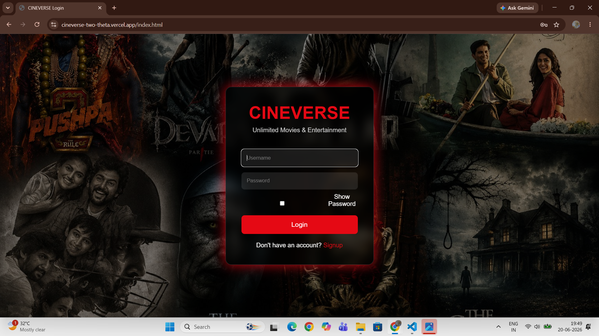
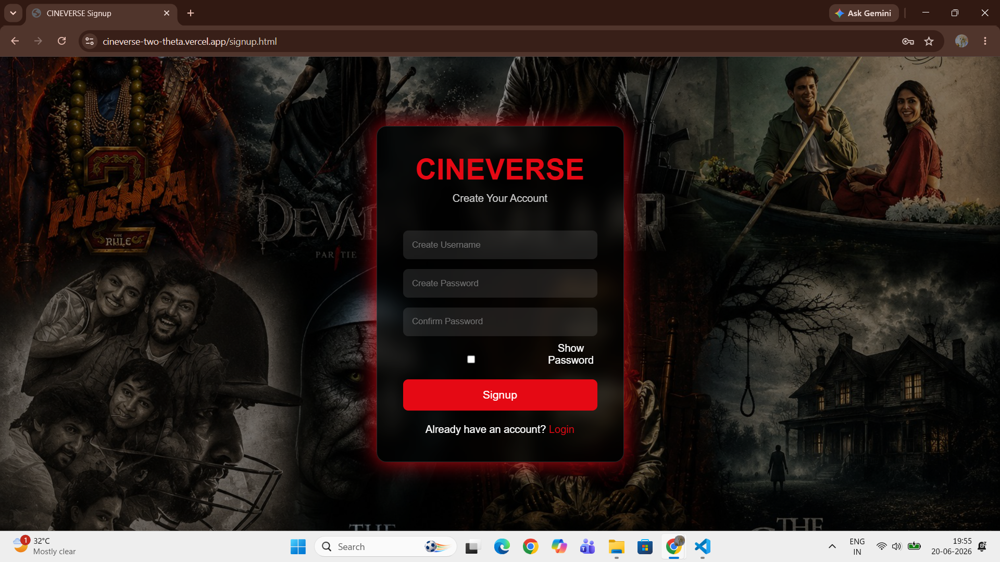
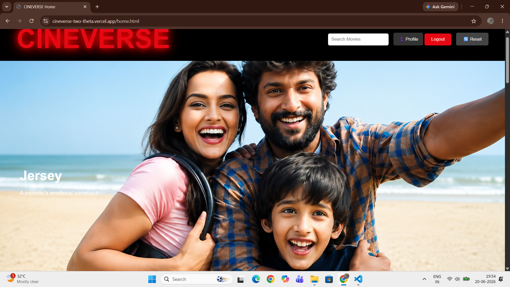
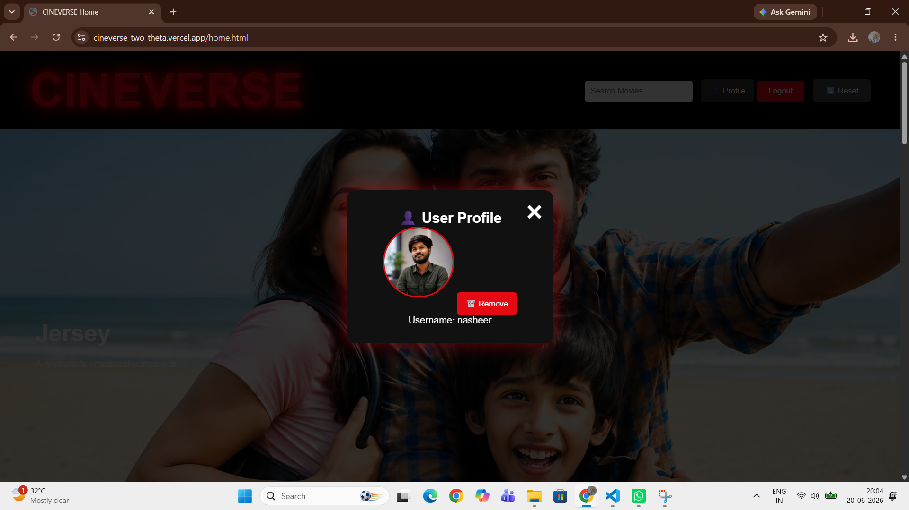
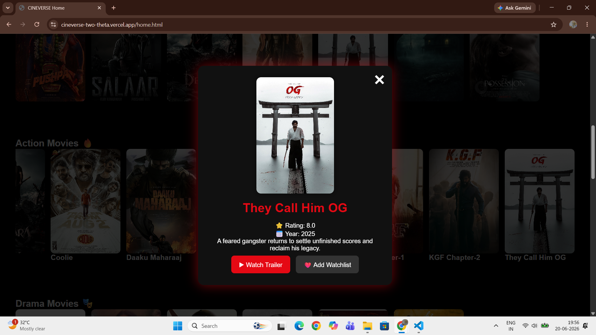
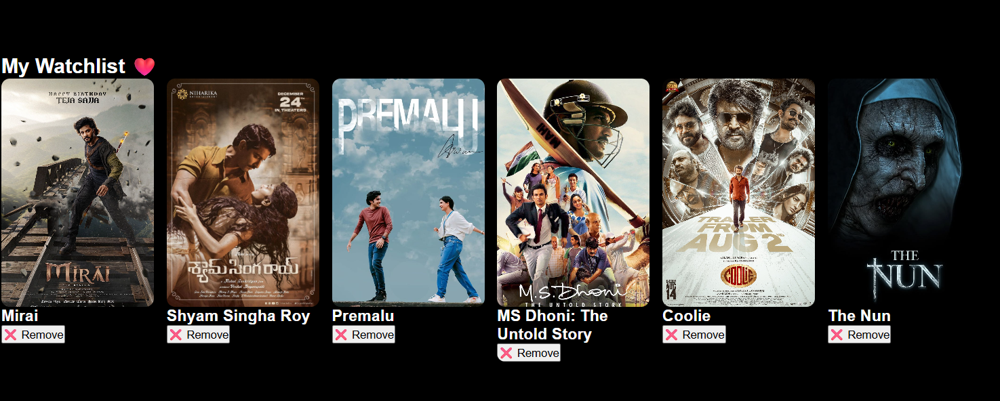

# CINEVERSE

# 🎬 CINEVERSE - OTT Streaming Platform

CINEVERSE is a Modern OTT Streaming Platform web application built using HTML, CSS, and JavaScript. It allows users to browse movies, watch trailers, manage their watchlist, and continue watching their favorite content.

## 🚀 Features

* 🔐 User Login & Signup
* 👁️ Show Password Option
* ✅ Confirm Password Validation
* 👤 User Profile
* 🖼️ Profile Picture Upload & Remove
* 🎬 Movie Categories (Action, Drama, Horror, Romance, Sci-Fi, etc.)
* 🔍 Search Movies
* ▶️ Watch Movie Trailers
* ❤️ Add Movies to Watchlist
* 📺 Continue Watching Section
* 🔄 Reset Watchlist & Continue Watching
* ℹ️ Movie Details Popup
* 🎨 Responsive User Interface
* 🎥 Hero Banner Section
* 🚀 CINEVERSE Splash Screen Animation

## 🛠️ Technologies Used

* HTML
* CSS
* JavaScript

## 📂 Project Structure

CINEVERSE/

├── index.html

├── signup.html

├── home.html

├── splash.html

├── style.css

├── script.js

├── images/

## 🎯 Future Enhancements

* Firebase Authentication
* Movie API Integration
* Ratings & Reviews
* Backend Database Support

## 📸 Screenshots

### Login Page

### Signup Page

### Home Page

### User Profile

### Movie Details Popup

### Watchlist Page

## 🌐 Live Demo

Add your deployed Vercel link here:

https://cineverse-two-theta.vercel.app

## 👨‍💻 Author

Developed by Sheik Nasheeruddin

---

⭐ If you like this project, don't forget to star the repository!
